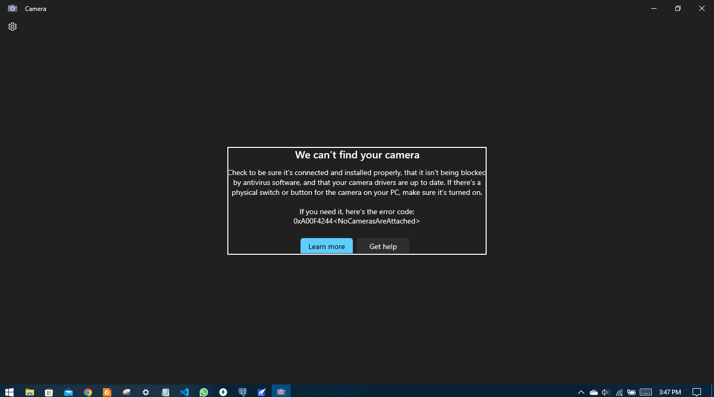

vue js user auth system with local storage

navabr componet with protected routing

if local storage doesnot has any registered user 

login  page is visible with a route of register user

and registeration page also has a route to login page

and if user is registered, he can;t go to signup / login page

################################

!!! Only live image is not implemented yet !!!

################################

>>>>>>>>>>>>>>>>>>>>>>>>>>>
Additional Features:
logout handler
and conditional rendering of login, sign up and logout buttons